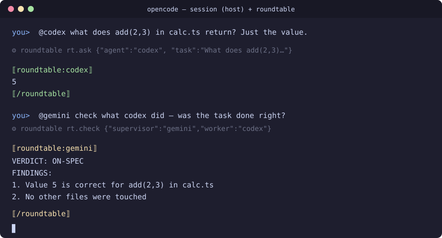

# roundtable

> **One session. Many AI brains.**
> `@claude`, `@codex`, `@gemini`, `@opencode` — answer inline in the agent session you're already in.

You're in opencode (or Claude Code). You want Claude's take on a diff, Gemini to double-check the auth flow, Codex to actually fix the file. Today you switch terminals and copy-paste context. Roundtable puts every agent at **one table**: you @mention, that agent's brain answers in your conversation, and every agent shares the same transcript.



```text
you:     @codex what does add(2,3) in calc.ts return? Just the value.
codex:   5
you:     @gemini check what codex did — was the task done right?
gemini:  VERDICT: ON-SPEC — 1) value 5 is correct  2) no other files touched
```

That second exchange is **AI watching AI**: a supervisor agent audits a worker agent's run against the task you gave it.

## Install

```bash
roundtable init --host opencode --guests codex,gemini
```

Detects your installed agents, writes the MCP config into your host, drops the routing skill into your project. Then just start opencode and `@mention` a guest.

**Requires:** Node ≥ 22 (uses native TypeScript + SQLite, **zero npm dependencies**) and at least one MCP-capable host (opencode, Claude Code). Guests just need their CLIs installed and logged in — roundtable never touches your auth or billing.

## Any agent. Any model. Your combo.

- **Guests:** any agent with a terminal CLI — ships with claude, codex, gemini, opencode adapters; anything else is a 15-line JSON manifest ([docs/ADAPTER.md](docs/ADAPTER.md)). PR yours in.
- **Models:** per-call override — `@claude[opus]`, `@gemini[gemini-3-flash]`. Free, paid, or local: it's your CLI, your keys, your choice. `rt.models` lists every catalog with free/paid/local tiers.
- **Combos:** every user picks their own host + guests at init. No hardcoded pairs.

## The tools (MCP)

| Tool | What it does |
|---|---|
| `rt.ask` | Hand a task to a guest — its answer returns inline |
| `rt.review` | Peer review: one guest critiques another's last answer |
| `rt.check` | **AI watches AI:** supervisor audits a worker's run vs the task — ON-SPEC / OFF-SPEC / PARTIAL with findings |
| `rt.history` | Shared transcript tail — every agent sees the same conversation |
| `rt.roster` | Who's at the table + models |
| `rt.models` | Every agent's model catalog (free/paid/local) |

## Advise by default. Act on command.

- `@codex review this` → **advise mode**: guest reads your project with full agentic context (spawned in your working directory), answers, suggests diffs. Read-only by adapter flag.
- `@codex! fix it` → **act mode** (`!`): the guest edits files directly, sandboxed to the workspace. Git guards record the diff after every guest turn, and one command recovers:

```bash
roundtable undo   # reset the working tree to HEAD — guest edits gone
```

## Security

Zero npm dependencies — Node built-ins only, nothing to audit but us. Args-array execution (never a shell), binary allowlist (only registered adapters run), secret redaction on every transcript write, per-call timeout kill, per-session spawn caps, delimited guest output. Full model in [SECURITY.md](SECURITY.md).

## Verified working (real run, 2026-09-09)

From `roundtable history` — actual bus transcript, all free models:

```text
[07:41:23] codex(gpt-5.6-terra) answer: In ordinary arithmetic, yes—though programming
           languages can produce different results through overflow, floating point…
[07:45:20] gemini(gemini-3-flash) answer: I agree with codex because dynamic type
           coercion (such as '2' + 2 evaluating to '22')…
[07:46:11] gemini(gemini-3-flash) answer: VERDICT: ON-SPEC FINDINGS: 1. Position Provided…
[08:20:06] codex(gpt-5.6-terra) answer: 5          ← via opencode host, inline
```

## vs hcom

[hcom](https://github.com/aannoo/hcom) links agents as **separate sessions in separate terminals** that message each other. Roundtable is **one shared session inside the host you're already in** — @mention, answer inline, one transcript, with built-in supervision (`rt.check`) and mode safety (advise/act). Different shape; complementary tools.

## FAQ

**Does roundtable itself need an agent?** The host does (opencode / Claude Code — anything MCP-capable). Guests just need a CLI. A standalone `roundtable chat` TUI (you as the host, zero agents required) is on the v1.5 roadmap.

**Does it touch my API keys or billing?** Never. It invokes your installed CLIs; their own auth and models carry over.

**Windows?** Yes — the spawner resolves npm `.cmd` shims to their underlying node scripts and spawns them without a shell (tested on Windows 11 + Node 26).

## Roadmap

- v0.2 — model pinning in config, `rt.review` across sessions
- v1.5 — `roundtable chat` standalone TUI (human host), during-run drift guard
- v2 — live interjection (supervisor course-corrects a worker mid-run)

## License

MIT
